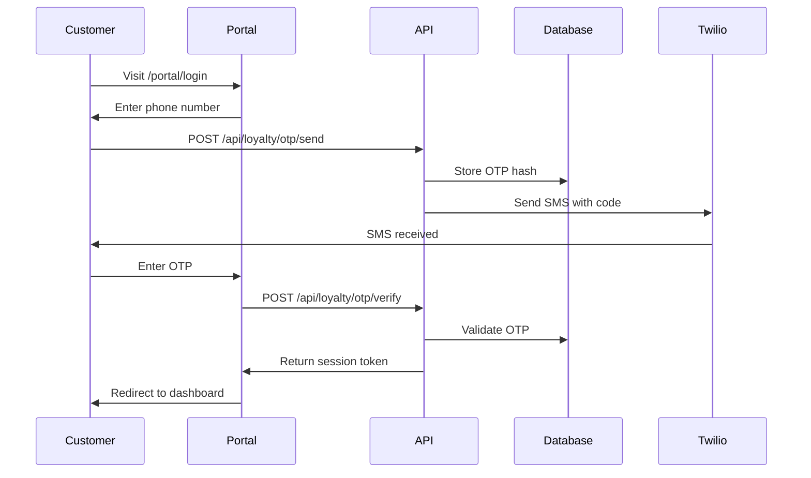
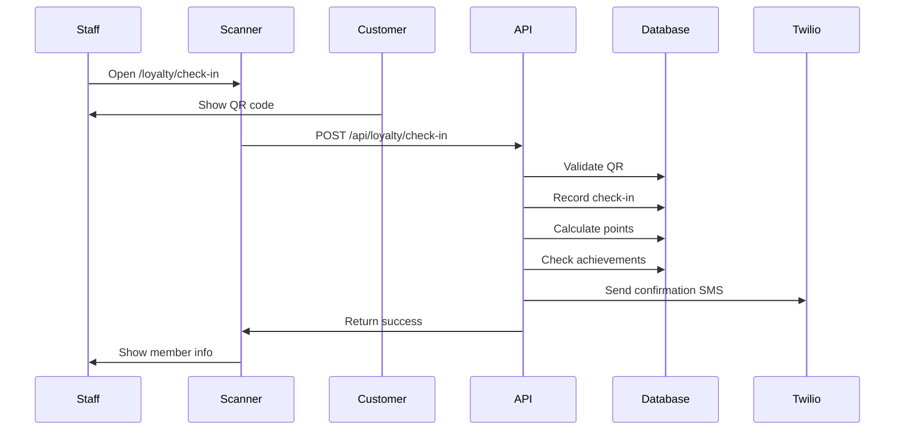

# The Anchor VIPs - Implementation Discovery Report

## Executive Summary

Based on comprehensive analysis of the existing codebase, database architecture, and security patterns, implementing The Anchor VIPs loyalty system is highly feasible within the current application. The system can leverage existing infrastructure for authentication, SMS, PDF generation, and database management while maintaining security and scalability.

---

## Current System Analysis

### 1. **Database Architecture**

**Existing Tables We'll Leverage:**
- `customers` - Core customer data with phone numbers
- `customer_labels` & `customer_label_assignments` - Can extend for loyalty tiers
- `bookings` - Track event attendance
- `events` - Event details for point calculations
- `audit_logs` - Comprehensive audit trail
- `jobs` - Background processing for points calculation

**Database Patterns:**
- UUID primary keys throughout
- RLS (Row Level Security) enabled on sensitive tables
- Timestamps and soft deletes
- JSONB for flexible data storage
- Strong foreign key relationships

### 2. **Authentication & Security**

**Current Implementation:**
- Supabase Auth for staff authentication
- Middleware-based route protection
- RBAC (Role-Based Access Control) with permissions
- Comprehensive audit logging
- Rate limiting infrastructure

**Security Strengths:**
- No customer-facing authentication currently exists (clean slate)
- Strong separation between public and authenticated routes
- Existing patterns for secure data access

### 3. **SMS Integration**

**Twilio Setup:**
- Full Twilio integration with retry logic
- Phone number standardization to E.164 format
- SMS health tracking per customer
- Job queue for async message processing
- Template-based messaging system

**Can Reuse For:**
- OTP delivery
- Welcome messages
- Achievement notifications
- Points balance updates

### 4. **PDF Generation**

**Current Implementation:**
- Puppeteer configured for serverless
- Invoice/quote PDF generation
- A4 format with professional styling
- Logo and branding integration

**Perfect For:**
- Table cards with QR codes
- Loyalty member certificates
- Monthly statements

### 5. **UI/UX Patterns**

**Component Library:**
- Tailwind CSS for styling
- Consistent form components
- Loading states with Loader2
- Error handling patterns
- Mobile-responsive designs
- Data tables with sorting/filtering

---

## Implementation Requirements

### 1. **New Database Tables**

```sql
-- Core loyalty tables needed
CREATE TABLE loyalty_programs (
  id UUID PRIMARY KEY DEFAULT gen_random_uuid(),
  name VARCHAR(255) NOT NULL,
  active BOOLEAN DEFAULT true,
  settings JSONB DEFAULT '{}',
  created_at TIMESTAMPTZ DEFAULT NOW(),
  updated_at TIMESTAMPTZ DEFAULT NOW()
);

CREATE TABLE loyalty_tiers (
  id UUID PRIMARY KEY DEFAULT gen_random_uuid(),
  program_id UUID REFERENCES loyalty_programs(id),
  name VARCHAR(100) NOT NULL,
  level INTEGER NOT NULL,
  min_events INTEGER NOT NULL,
  point_multiplier DECIMAL(3,2) DEFAULT 1.0,
  color VARCHAR(7), -- Hex color for UI
  icon VARCHAR(50), -- Icon name
  benefits JSONB DEFAULT '[]',
  created_at TIMESTAMPTZ DEFAULT NOW()
);

CREATE TABLE loyalty_members (
  id UUID PRIMARY KEY DEFAULT gen_random_uuid(),
  customer_id UUID REFERENCES customers(id) UNIQUE,
  program_id UUID REFERENCES loyalty_programs(id),
  tier_id UUID REFERENCES loyalty_tiers(id),
  total_points INTEGER DEFAULT 0,
  available_points INTEGER DEFAULT 0,
  lifetime_points INTEGER DEFAULT 0,
  lifetime_events INTEGER DEFAULT 0,
  join_date DATE DEFAULT CURRENT_DATE,
  last_activity_date DATE,
  status VARCHAR(50) DEFAULT 'active',
  created_at TIMESTAMPTZ DEFAULT NOW(),
  updated_at TIMESTAMPTZ DEFAULT NOW()
);

CREATE TABLE event_check_ins (
  id UUID PRIMARY KEY DEFAULT gen_random_uuid(),
  booking_id UUID REFERENCES bookings(id),
  event_id UUID REFERENCES events(id),
  customer_id UUID REFERENCES customers(id),
  member_id UUID REFERENCES loyalty_members(id),
  check_in_time TIMESTAMPTZ DEFAULT NOW(),
  check_in_method VARCHAR(50), -- 'qr', 'manual'
  points_earned INTEGER DEFAULT 0,
  achievements_earned UUID[] DEFAULT '{}',
  staff_id UUID REFERENCES users(id),
  notes TEXT,
  created_at TIMESTAMPTZ DEFAULT NOW()
);

CREATE TABLE loyalty_point_transactions (
  id UUID PRIMARY KEY DEFAULT gen_random_uuid(),
  member_id UUID REFERENCES loyalty_members(id),
  points INTEGER NOT NULL, -- positive for earned, negative for spent
  balance_after INTEGER NOT NULL,
  transaction_type VARCHAR(50) NOT NULL, -- 'earned', 'redeemed', 'expired', 'adjusted'
  description TEXT,
  reference_type VARCHAR(50), -- 'check_in', 'achievement', 'redemption', etc
  reference_id UUID,
  created_at TIMESTAMPTZ DEFAULT NOW(),
  created_by UUID REFERENCES users(id)
);

CREATE TABLE loyalty_achievements (
  id UUID PRIMARY KEY DEFAULT gen_random_uuid(),
  program_id UUID REFERENCES loyalty_programs(id),
  name VARCHAR(255) NOT NULL,
  description TEXT,
  icon VARCHAR(50),
  points_value INTEGER DEFAULT 0,
  criteria_type VARCHAR(50), -- 'event_count', 'event_types', 'streak', etc
  criteria JSONB NOT NULL,
  active BOOLEAN DEFAULT true,
  seasonal BOOLEAN DEFAULT false,
  valid_from DATE,
  valid_to DATE,
  created_at TIMESTAMPTZ DEFAULT NOW()
);

CREATE TABLE customer_achievements (
  id UUID PRIMARY KEY DEFAULT gen_random_uuid(),
  member_id UUID REFERENCES loyalty_members(id),
  achievement_id UUID REFERENCES loyalty_achievements(id),
  earned_date TIMESTAMPTZ DEFAULT NOW(),
  points_awarded INTEGER DEFAULT 0,
  progress JSONB DEFAULT '{}',
  UNIQUE(member_id, achievement_id)
);

CREATE TABLE loyalty_rewards (
  id UUID PRIMARY KEY DEFAULT gen_random_uuid(),
  program_id UUID REFERENCES loyalty_programs(id),
  name VARCHAR(255) NOT NULL,
  description TEXT,
  points_cost INTEGER NOT NULL,
  tier_required UUID REFERENCES loyalty_tiers(id),
  reward_type VARCHAR(50), -- 'discount', 'freebie', 'experience'
  reward_value JSONB,
  inventory INTEGER,
  active BOOLEAN DEFAULT true,
  created_at TIMESTAMPTZ DEFAULT NOW()
);

CREATE TABLE reward_redemptions (
  id UUID PRIMARY KEY DEFAULT gen_random_uuid(),
  member_id UUID REFERENCES loyalty_members(id),
  reward_id UUID REFERENCES loyalty_rewards(id),
  points_spent INTEGER NOT NULL,
  redeemed_at TIMESTAMPTZ DEFAULT NOW(),
  fulfilled_at TIMESTAMPTZ,
  fulfilled_by UUID REFERENCES users(id),
  status VARCHAR(50) DEFAULT 'pending',
  notes TEXT
);

-- QR Code management
CREATE TABLE booking_qr_codes (
  id UUID PRIMARY KEY DEFAULT gen_random_uuid(),
  booking_id UUID REFERENCES bookings(id) UNIQUE,
  qr_data TEXT NOT NULL,
  qr_hash VARCHAR(64) UNIQUE NOT NULL,
  expires_at TIMESTAMPTZ,
  used BOOLEAN DEFAULT false,
  used_at TIMESTAMPTZ,
  created_at TIMESTAMPTZ DEFAULT NOW()
);

-- Customer authentication for portal
CREATE TABLE customer_auth_sessions (
  id UUID PRIMARY KEY DEFAULT gen_random_uuid(),
  customer_id UUID REFERENCES customers(id),
  session_token VARCHAR(255) UNIQUE NOT NULL,
  expires_at TIMESTAMPTZ NOT NULL,
  ip_address INET,
  user_agent TEXT,
  is_active BOOLEAN DEFAULT true,
  created_at TIMESTAMPTZ DEFAULT NOW()
);

CREATE TABLE customer_otp_codes (
  id UUID PRIMARY KEY DEFAULT gen_random_uuid(),
  customer_id UUID REFERENCES customers(id),
  otp_hash VARCHAR(64) NOT NULL,
  expires_at TIMESTAMPTZ NOT NULL,
  attempts INTEGER DEFAULT 0,
  used BOOLEAN DEFAULT false,
  created_at TIMESTAMPTZ DEFAULT NOW()
);
```

### 2. **New Routes & Pages**

**Staff Routes (Protected):**
- `/loyalty` - Main dashboard
- `/loyalty/members` - Member management
- `/loyalty/check-in` - QR scanner interface
- `/loyalty/rewards` - Reward management
- `/loyalty/achievements` - Achievement configuration
- `/loyalty/analytics` - Reports and insights
- `/loyalty/table-cards/[eventId]` - Print table cards

**Customer Routes (Public):**
- `/portal` - Landing page
- `/portal/login` - OTP authentication
- `/portal/dashboard` - Member dashboard
- `/portal/achievements` - View achievements
- `/portal/rewards` - Browse/redeem rewards
- `/portal/history` - Event history
- `/portal/qr` - Display QR code

**API Routes:**
- `/api/loyalty/otp/send` - Send OTP
- `/api/loyalty/otp/verify` - Verify OTP
- `/api/loyalty/check-in` - Process check-in
- `/api/webhooks/loyalty` - External integrations

### 3. **New Dependencies**

```json
{
  "dependencies": {
    "qrcode": "^1.5.3", // QR code generation
    "react-qr-reader": "^3.0.0-beta-1", // QR scanning
    "date-fns": "^2.30.0", // Date calculations for streaks
    "bcryptjs": "^2.4.3", // OTP hashing
    "react-countdown": "^2.3.5", // OTP countdown timer
    "recharts": "^2.10.0", // Analytics charts
    "framer-motion": "^10.16.0" // Achievement animations
  }
}
```

### 4. **New Server Actions**

```typescript
// Core loyalty actions needed
- createLoyaltyMember()
- updateMemberTier()
- awardPoints()
- deductPoints()
- checkInMember()
- unlockAchievement()
- redeemReward()
- generateTableCards()
- sendOTP()
- verifyOTP()
- createCustomerSession()
```

### 5. **New Components**

**Staff Components:**
- `<QRScanner />` - Camera-based QR scanner
- `<MemberCard />` - Display member info
- `<PointsCalculator />` - Manual point adjustments
- `<AchievementManager />` - Configure achievements
- `<TierProgressBar />` - Visual tier progress
- `<RewardCatalog />` - Manage rewards

**Customer Components:**
- `<OTPLogin />` - Phone number + OTP input
- `<LoyaltyDashboard />` - Points, tier, progress
- `<AchievementGrid />` - Visual achievement display
- `<RewardBrowser />` - Browse available rewards
- `<QRDisplay />` - Show member QR code
- `<EventHistory />` - Past attendance

### 6. **Cron Jobs**

```typescript
// New cron endpoints needed
- /api/cron/loyalty/calculate-streaks - Daily streak calculations
- /api/cron/loyalty/tier-reviews - Monthly tier adjustments
- /api/cron/loyalty/expire-points - Quarterly point expiry
- /api/cron/loyalty/achievement-progress - Check achievement criteria
```

### 7. **SMS Templates**

```typescript
// New SMS templates
const templates = {
  welcome: "Welcome to Anchor VIPs! You've earned 50 bonus points. Reply STOP to opt out.",
  otp: "Your Anchor loyalty code is: {code}. Valid for 5 minutes.",
  tier_upgrade: "Congratulations! You've reached {tier} status. Enjoy your new benefits!",
  achievement: "🎉 Achievement unlocked: {name}! You've earned {points} points.",
  points_earned: "You've earned {points} points at {event}. Balance: {balance}",
  reward_ready: "Your reward is ready! Show this message at the bar: {code}",
  birthday: "Happy Birthday from The Anchor! Your birthday drink is waiting 🎂",
  win_back: "We miss you! Here's 100 bonus points for your next visit."
};
```

---

## Technical Architecture

### 1. **Authentication Flow**



### 2. **Check-In Flow**



### 3. **Table Card Generation**

```typescript
// PDF generation for table cards
export async function generateTableCards(eventId: string) {
  const supabase = await createClient();
  
  // Get all bookings for event
  const { data: bookings } = await supabase
    .from('bookings')
    .select(`
      *,
      customer:customers(*),
      event:events(*),
      loyalty_member:customers(loyalty_members(*))
    `)
    .eq('event_id', eventId)
    .eq('status', 'confirmed');
    
  // Generate HTML for each card
  const cards = bookings.map(booking => generateCardHTML(booking));
  
  // Convert to PDF using Puppeteer
  const pdf = await generatePDF(cards, {
    format: 'A4',
    printBackground: true,
    margin: { top: '10mm', bottom: '10mm', left: '10mm', right: '10mm' }
  });
  
  return pdf;
}
```

---

## Implementation Phases

### Phase 1: Foundation (Week 1-2)
- [ ] Create database migrations
- [ ] Set up loyalty program configuration
- [ ] Build tier management system
- [ ] Create basic member enrollment
- [ ] Implement points calculation engine

### Phase 2: Check-In System (Week 3-4)
- [ ] QR code generation for bookings
- [ ] Build staff check-in interface
- [ ] Implement QR scanning
- [ ] Create manual check-in fallback
- [ ] Add attendance tracking

### Phase 3: Customer Portal (Week 5-6)
- [ ] Build OTP authentication
- [ ] Create customer dashboard
- [ ] Implement achievement display
- [ ] Add reward browsing
- [ ] Build QR code display

### Phase 4: Table Cards (Week 7)
- [ ] Design card template
- [ ] Implement PDF generation
- [ ] Add batch printing
- [ ] Include personalization
- [ ] Test print quality

### Phase 5: Gamification (Week 8-9)
- [ ] Build achievement engine
- [ ] Create achievement criteria
- [ ] Implement progress tracking
- [ ] Add notification system
- [ ] Create leaderboards

### Phase 6: Analytics (Week 10)
- [ ] Build management dashboard
- [ ] Create member reports
- [ ] Add financial metrics
- [ ] Implement predictions
- [ ] Export capabilities

### Phase 7: Testing & Training (Week 11-12)
- [ ] Comprehensive testing
- [ ] Staff training materials
- [ ] Customer guides
- [ ] Performance optimization
- [ ] Security audit

---

## Risk Assessment

### Technical Risks

1. **QR Code Security**
   - Risk: Forged QR codes
   - Mitigation: HMAC signatures, time-based expiry

2. **Performance at Scale**
   - Risk: Slow check-ins during busy events
   - Mitigation: Caching, optimized queries, CDN for QR codes

3. **SMS Delivery**
   - Risk: OTP delays affecting login
   - Mitigation: Backup authentication methods, longer validity

### Operational Risks

1. **Staff Adoption**
   - Risk: Resistance to new system
   - Mitigation: Intuitive UI, comprehensive training

2. **Customer Confusion**
   - Risk: Complex portal navigation
   - Mitigation: Simple design, clear CTAs

3. **Data Migration**
   - Risk: Historical data accuracy
   - Mitigation: Careful validation, audit trails

---

## Resource Requirements

### Development Team
- 1 Full-stack developer (12 weeks)
- UI/UX consultation (20 hours)
- Testing support (40 hours)

### Infrastructure
- No additional servers needed
- Increased database storage (~10GB/year)
- Higher SMS volume (~2000/month additional)

### Training
- Staff training sessions (4 hours × 3 sessions)
- Documentation creation (20 hours)
- Video tutorials (10 hours)

---

## Success Criteria

### Technical Metrics
- [ ] Check-in time < 3 seconds
- [ ] Portal load time < 2 seconds
- [ ] 99.9% uptime
- [ ] Zero security breaches

### Business Metrics
- [ ] 500+ members in Year 1
- [ ] 60% monthly active rate
- [ ] 85% satisfaction score
- [ ] 7.5:1 ROI

### Operational Metrics
- [ ] 95% staff adoption
- [ ] < 5% support tickets
- [ ] 90% self-service rate

---

## Next Steps

1. **Approval** - Review and approve implementation plan
2. **Environment Setup** - Create development branch
3. **Database Design** - Finalize schema and create migrations
4. **Prototype** - Build proof of concept for QR check-in
5. **Iterate** - Weekly reviews and adjustments

---

## Conclusion

The implementation of The Anchor VIPs loyalty system is technically feasible and can be accomplished within 12 weeks using existing infrastructure. The system will provide significant value through increased customer engagement, valuable data insights, and improved operational efficiency. With proper planning and phased rollout, risks are minimal and success probability is high.