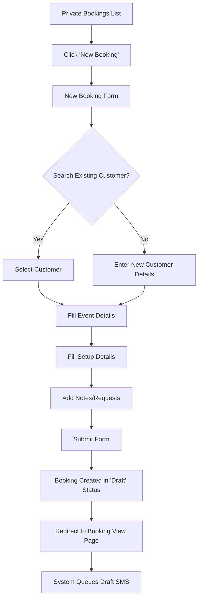
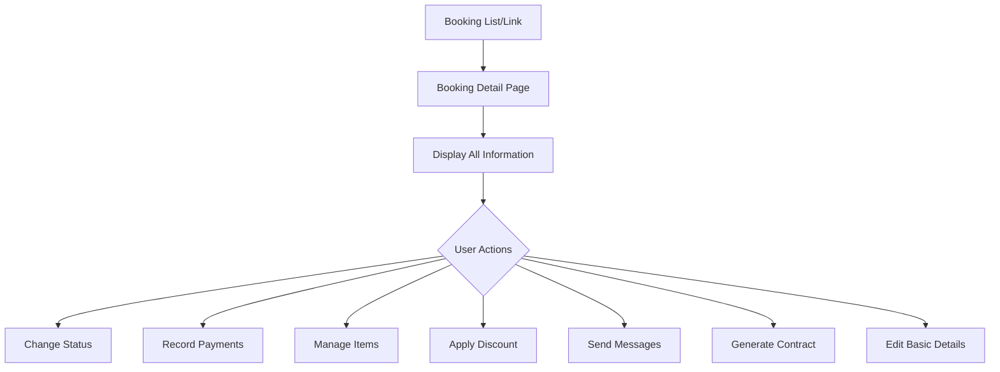
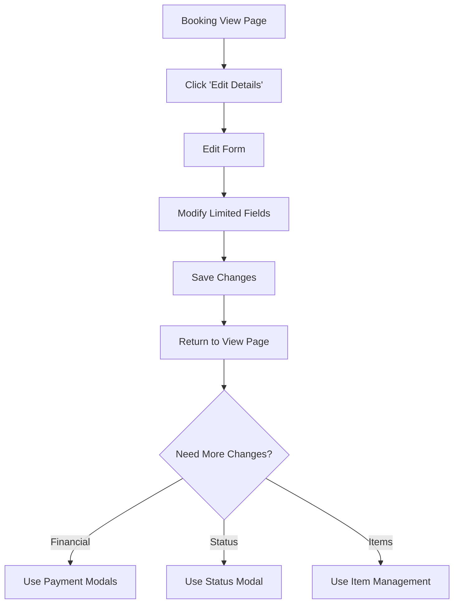
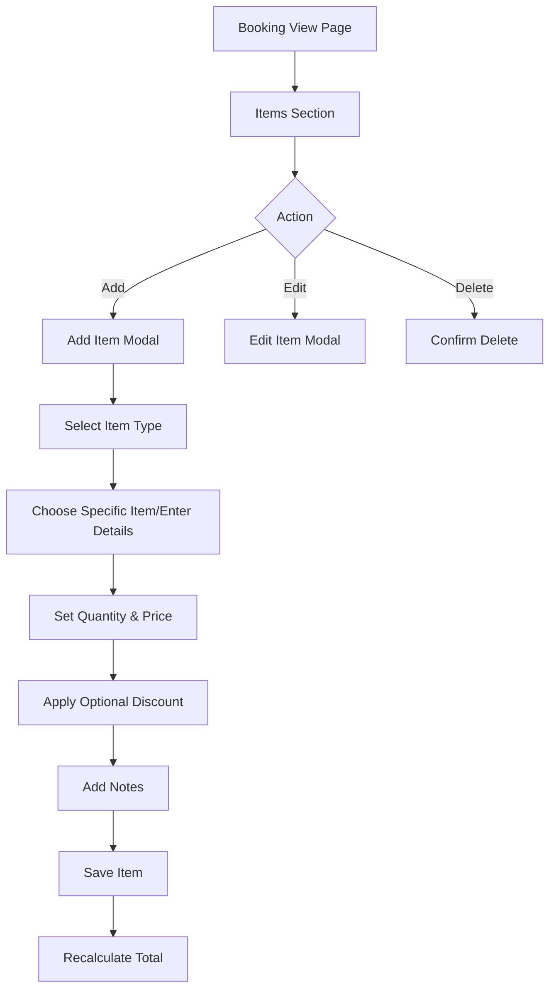
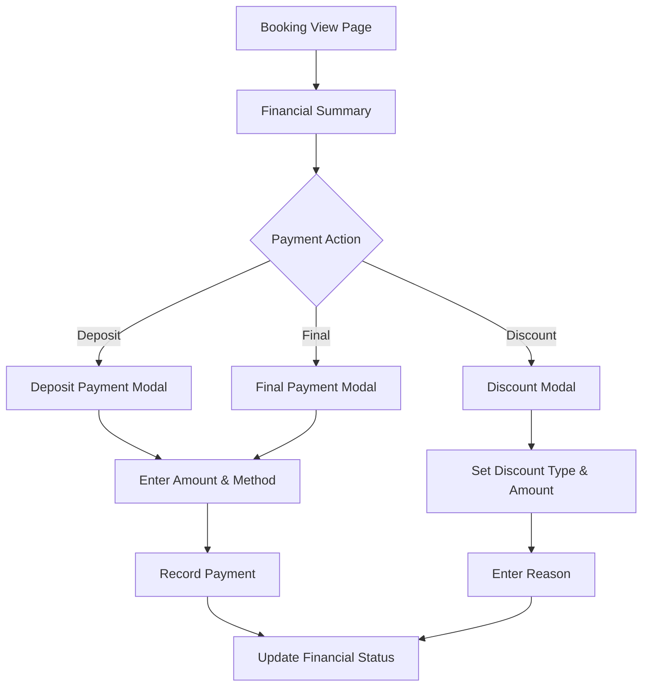
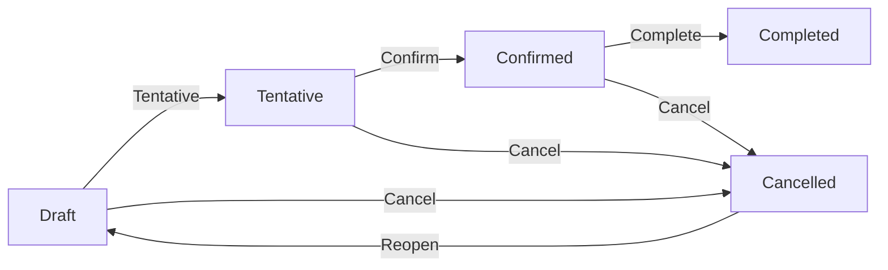
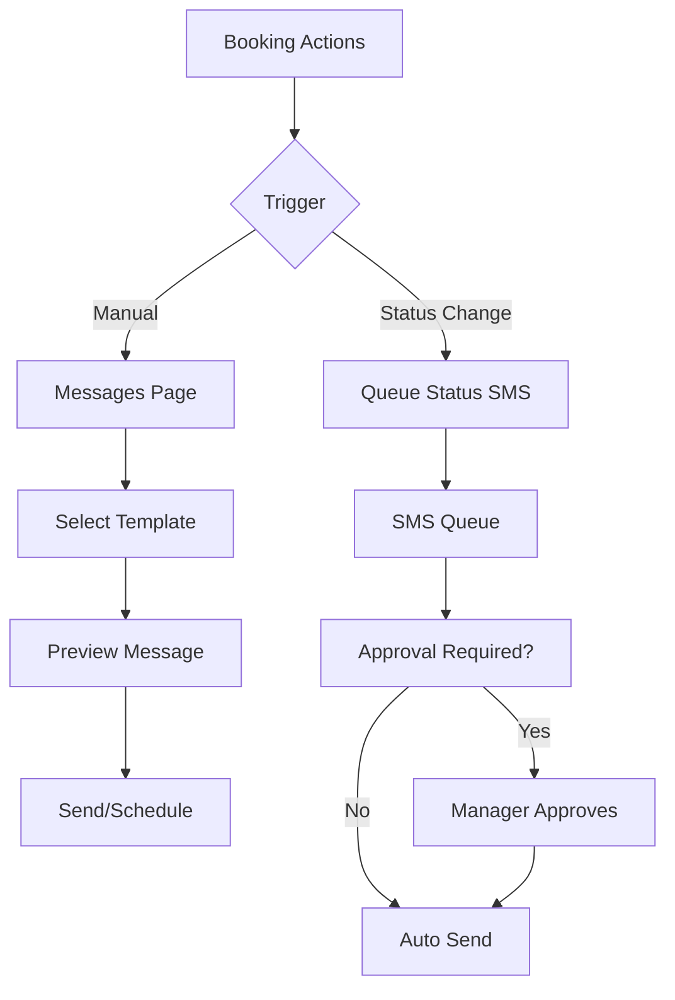

# Private Bookings User Flow

## Overview

This document describes the user journey for managing private venue hire bookings in The Anchor Management Tools.

## Main User Flows

### 1. Creating a New Booking

**Available Fields in Create Form:**
- Customer search/selection
- Customer first/last name
- Contact phone/email
- Event date, type, times
- Guest count
- Setup date/time
- Customer requests
- Internal notes

**Missing Fields (must be added later):**
- Special requirements
- Accessibility needs
- Source
- Financial details
- Status (always starts as 'draft')

### 2. Viewing a Booking

**View Page Shows:**
- Complete customer information
- All event details
- Financial summary with payment status
- Booking items with line-item management
- Notes & requirements (all 4 types)
- Status with transition options
- Quick actions menu
- Booking metadata

### 3. Editing a Booking

**Editable Fields:**
- Customer name (first/last)
- Contact details
- Event date/type/times
- Guest count
- Setup time (not date!)
- Customer requests
- Internal notes

**Non-Editable in Form:**
- Customer selection (can't change customer)
- Status
- All financial fields
- Discounts
- Special requirements
- Accessibility needs
- Source

### 4. Managing Booking Items

**Item Types:**
- Venue Space
- Catering Package
- Vendor Service
- Electricity (£25 fixed)
- Other (custom)

### 5. Financial Management

**Payment Recording:**
- Custom amount override
- Payment methods: Card, Cash, Invoice
- Automatic balance calculation
- Payment status tracking

### 6. Status Progression

**Status Rules:**
- Draft → Tentative or Cancelled
- Tentative → Confirmed or Cancelled  
- Confirmed → Completed or Cancelled
- Completed → No changes
- Cancelled → Draft (reopen)

### 7. Communication Flow

## Key Pain Points

### 1. Two-Step Processes
Many operations require creating/editing on one page, then using modals on the view page:
- Setting custom deposit amounts
- Changing booking status
- Recording payments
- Managing special requirements

### 2. Field Access Limitations
Users cannot access all fields through forms:
- No `special_requirements` or `accessibility_needs` in any form
- No `source` field to track booking origin
- No financial fields in create/edit forms
- Cannot change linked customer after creation

### 3. Inconsistent UI Patterns
- Event type: Dropdown in edit, free text in create
- Setup date: Available in create but not edit
- Status changes: Only through modal, not form

### 4. Missing Automation Opportunities
- Balance due date is auto-calculated but not adjustable
- No automatic status progression based on payments
- No bulk operations for common tasks

## Recommended Improvements

### Quick Wins
1. Add missing fields to forms (special requirements, accessibility, source)
2. Standardize event_type input across forms
3. Add setup_date to edit form

### Medium Term
4. Enable customer re-selection in edit form
5. Add financial field overrides in create form
6. Implement status field in edit form with proper validation

### Long Term
7. Create unified booking management interface
8. Add bulk operations for common tasks
9. Implement automated workflows for status/payment progression
10. Add template system for common booking types